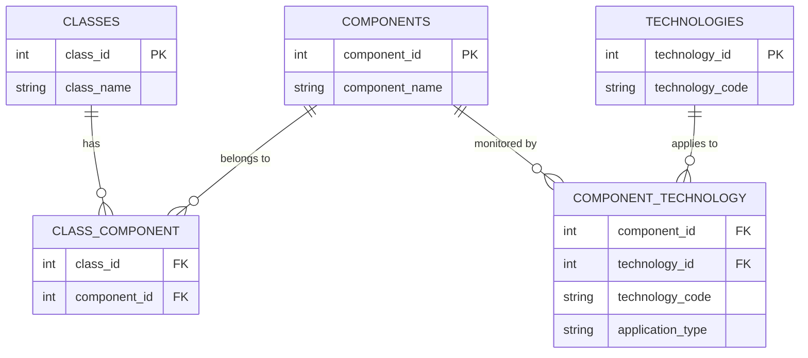

# ACM Configuration System

## Overview

The ACM configuration system defines the **monitoring requirements standard** — the business rules that determine which technologies should be applied to which assets. It answers the question: *"Given this asset's class, what monitoring technologies does it need?"*

This is the foundation of Phase 1 (Needs Monitoring) in the ACM pipeline. The config is stored as a set of normalized CSV files managed by the `ACMConfig` Python class (`acm_config.py`).

---

## The Big Picture

The config encodes a two-step chain of logic:

```
Asset Class  →  Components  →  Technologies (Primary / Secondary)
```

An **asset class** (e.g., `Pump`) is made up of **components** (e.g., `Rolling Element Bearings (Grease)`, `Electric Motors - Bearings`). Each component has known technology requirements with a priority rating — **Primary** (must-have) or **Secondary** (nice-to-have). The config tables encode both legs of this chain.

---

## Files

| File | Description | Rows |
|------|-------------|------|
| `technologies.csv` | Master list of monitoring technology codes | 8 |
| `components.csv` | Master list of monitorable component types | 25 |
| `classes.csv` | Master list of asset classes (from Maximo) | 129 |
| `component_technology.csv` | Junction: which technologies apply to each component (with Primary/Secondary rating) | ~65 |
| `class_component.csv` | Junction: which components make up each asset class | ~172 |

---

## Entity Relationship Diagram



---

## How the Query Chain Works

When the pipeline asks *"What does an asset of class X need?"*, the `ACMConfig` class resolves it in two hops:

```
CLASSES → CLASS_COMPONENT → COMPONENTS → COMPONENT_TECHNOLOGY → TECHNOLOGIES
```

For example, a **Chain Conveyor** asset class:

1. `classes.csv`: look up `Chain Conveyor` → `class_id = 15`
2. `class_component.csv`: find all `component_id` where `class_id = 15` → components like `Chain Drives`, `Electrical Connections`
3. `component_technology.csv`: for each component, find applicable technologies
4. Result: `VI (Primary)`, `UL (Secondary)`, `IR (Primary)`, etc.

The highest priority rating wins if multiple components drive the same technology (Primary beats Secondary).

---

## Technology Codes

| Code | Domain |
|------|--------|
| GM | General Metering |
| IR | Infrared Thermography |
| UL | Ultrasound |
| VI | Vibration Analysis |
| LU | Lubrication |
| MC | Motor Circuit Analysis |
| ZD | Robotics Monitoring |
| CW | Chain Monitoring |

---

## Application Type

Each `component_technology` record carries an `application_type`:

| Value | Meaning |
|-------|---------|
| `Primary` | Technology is a core requirement for this component |
| `Secondary` | Technology provides supplemental coverage — beneficial but not mandatory |

In the pipeline's NEEDS logic, an asset gets:
- `NEEDS_[TECH] = P` if any component drives a Primary requirement
- `NEEDS_[TECH] = S` if only Secondary requirements exist
- `NEEDS_[TECH] = N` if no requirements exist

---

## ACMConfig Python Class

`acm_config.py` wraps all five CSVs into a single manager object with clean query methods.

### Initialization

```python
from acm_config import ACMConfig

config = ACMConfig(config_dir='data/st_tbl/normalized_config')
config.summary()
```

### Key Query Methods

```python
# What technologies does a Pump class need?
config.get_class_technologies('Pumps')

# What components are in a Chain Conveyor?
config.get_class_components('Chain Conveyor')

# What technologies apply to electric motor bearings?
config.get_component_technologies('Electric Motors - Bearings')

# Which asset classes use a given component?
config.get_component_classes('Rolling Element Bearings (Grease)')

# What components does VI monitor?
config.get_technology_components('VI', application_type='Primary')
```

### Mutation Methods

The class also supports adding new entries and saving back to CSV:

```python
config.add_component('New Component Type')
config.add_technology('XX')
config.assign_technology_to_component('New Component Type', 'XX', 'Primary')
config.assign_component_to_class('Pumps', 'New Component Type')
config.save_all()
```

### Backwards Compatibility Export

If the legacy cross-tab format is needed (e.g., for the old Quarto pipeline):

```python
config.export_comp_xref_tech(output_file='comp_xref_tech_export.csv')
config.export_class_xref_comp(output_file='class_xref_comp_export.csv')
```

---

## Validation

Run `config.validate()` to check for:
- Components with no technology assignments
- Components not assigned to any asset class

---

## File Location

These CSVs live in `data/st_tbl/` (or a `normalized_config/` subfolder). The `ACMConfig` class path defaults to `normalized_config` — update the `config_dir` argument if your layout differs.

```
data/
└── st_tbl/
    ├── technologies.csv
    ├── components.csv
    ├── classes.csv
    ├── component_technology.csv
    └── class_component.csv
```

---

*Last updated: February 2026*
